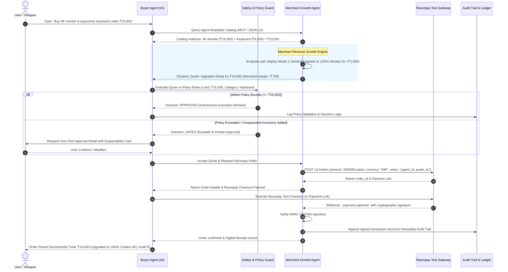

# Razorpay Buildathon 2026 — Track 01: AI Growth & Agentic Commerce

> **Project Concept**: **AgentPay Nexus** — *The Bounded, Explainable Agent-to-Merchant (A2M) Commerce Engine on Razorpay*  
> **Documentation**: See full Product Requirements Document in [`docs/PRD.md`](file:///d:/Razor_Pay_Track/docs/PRD.md)

---

## Part 1: Track 01 Explained (Plain English + Technical Depth)

### 1. What is Track 01 Doing?
Currently, e-commerce is designed exclusively for humans: you search for a product on Google/Amazon, browse through 10 tabs, add items to cart, click buttons, enter addresses, and approve OTPs.

**Track 01 reimagines commerce where autonomous AI agents do the shopping and selling:**
1. **AI Buyer Agents**: You tell your AI assistant: *"Buy me the best desk setup for coding under ₹20,000"*. The AI negotiates, selects the best options, checks your budget constraints, and buys it autonomously.
2. **AI Merchant Agents (Revenue Growth)**: Merchants expose structured, machine-readable interfaces (MCP / Agent protocols) so any AI buyer in the world can discover and transact with them. In addition, the merchant's AI intelligently maximizes revenue by offering real-time custom bundles, upsells, and negotiated bulk discounts.
3. **Razorpay Payment Rails**: The transactions are settled reliably through Razorpay test-mode APIs (Orders, Payment Links, Webhooks).

---

### 2. The Core Functionality Required
To win this track, the system must deliver four core capabilities:

1. **Agent-Readable Catalog (Discovery)**:
   - Exposes product data with structured schemas (JSON-LD, MCP endpoints, OpenAPI) so AI models can parse specs, stock, and pricing without web scraping.
2. **AI Growth & Dynamic Revenue Optimizer (Merchant Side)**:
   - Evaluates incoming buyer intent and dynamically deploys **4 Revenue Growth Strategies** to increase cart value or close deals while strictly respecting merchant gross profit margins.
3. **Adaptive Bounded & Gated HITL Safety (The Crucial Evaluation Bar)**:
   - AI agents must never have carte blanche access to a credit card. Every financial movement must be **bounded** (e.g., max ₹10,000/day, allowed product categories only) and **gated** (if an action exceeds limits or introduces unrequested items, it halts and requests human one-click authorization).
4. **Explainable Audit Trail & Graceful Error Handling**:
   - Every single rupee spent must have a plain-English explanation: *Why did the agent pick this item? What discount was applied? Why did it pass/fail the safety gate?*
   - Handled failure scenario: what happens when an item is out of budget, stock runs out, or payment drops? The agent recovers gracefully without getting stuck or losing data.

---

### 3. Why Now? (Industry Standards)
- **NPCI UAP (Unified Autonomous Payments / UPI Agent Protocol)**: India's NPCI is pioneering delegated agent payments where users delegate pre-authorized payment caps to AI bots.
- **ACP (Agentic Commerce Protocol)**: The emerging standard for how agents request quotes, negotiate carts, and exchange settlement tokens.
- **AP2 & x402 (HTTP 402 Payment Required)**: Standard HTTP status codes enabling AI agents to pay programmatically for APIs and goods over lightning/fiat rails.
- **Razorpay's Vision**: Making millions of merchants transactable by millions of AI agents globally.

---

## Part 2: The 4 AI Merchant Revenue Growth Models

The Merchant AI does not blindly push random accessories that waste the buyer's money. It dynamically selects from **4 specialized revenue growth strategies** depending on the buyer's intent, budget headroom, and inventory availability:

```
                              ┌──────────────────────────────────────────────┐
                              │     4 AI Merchant Revenue Growth Models      │
                              └──────────────────────┬───────────────────────┘
                                                     │
         ┌───────────────────┬───────────────────────┴───────────────────────┬───────────────────┐
         ▼                   ▼                                               ▼                   ▼
  1. Quality Upgrade   2. Conversion Closer                            3. Bulk/Subscription  4. Value Services
  (Vertical Upsell)    (Dynamic Discount)                              (Future Revenue)      (Warranty/Care)
  Better item instead   Save the deal from                              Discount for 6-month  Extended support
  of extra item         bouncing to competitor                          refill commitment     or express shipping
```

### 1. Quality Upgrade (Vertical Upsell — Better Product, Not More Products)
* **How It Works**: If the buyer has leftover budget but wants strict essentials, the Merchant AI recommends upgrading one of the requested items to a superior tier (e.g., standard 60Hz 4K monitor -> 120Hz Creator 4K monitor) at a discounted upgrade price.
* **Why It Works**: Zero physical clutter for the buyer; higher transaction value and margin for the merchant.

### 2. Conversion Closer (Dynamic Anti-Abandonment Discount)
* **How It Works**: When a buyer agent compares multiple stores, the Merchant AI detects abandonment risk and offers an instant 2–5% **Autonomous Instant-Settlement Discount** via Razorpay test rails.
* **Why It Works**: Converts a potential bounce into guaranteed captured revenue while staying above the merchant's gross margin floor.

### 3. Bulk / Subscription / Replenishment (Future LTV Lock-In)
* **How It Works**: For recurring consumables (coffee beans, printer toner, cloud credits), the Merchant AI offers a discounted recurring mandate via Razorpay Subscriptions / UPI Autopay.
* **Why It Works**: Locks in long-term Customer Lifetime Value (LTV).

### 4. Value-Add Services & Protection (Zero-Clutter Peace of Mind)
* **How It Works**: Bundles 2-Year Express Replacement Warranty or Same-Day Priority Delivery at marginal cost.
* **Why It Works**: High-margin digital service for the merchant; genuine risk reduction for the buyer.

---

## Part 3: Adaptive Bounded & Gated HITL Safety Framework

To solve both **uncontrolled AI spending** and **HITL notification fatigue**, AgentPay Nexus implements a 3-Tier Adaptive Safety Architecture:

```
                                  INCOMING TRANSACTION
                                           │
                        ┌──────────────────┴──────────────────┐
                        ▼                                     ▼
             [ WITHIN USER BOUNDS ]               [ OUTSIDE BOUNDS / AMBIGUOUS ]
          • Below pre-set limit (e.g. <₹5,000)   • Exceeds budget or new category
          • Whitelisted merchant                 • Unrequested upsell items
          • Strict intent matched                • Price drift > 5%
                        │                                     │
                        ▼                                     ▼
              ⚡ TIER 1: AUTONOMOUS                🛡️ TIER 2: GATED HITL
             (Zero friction, instant)             (Presents 1-Click Explainability Card)
                                                              │
                                                              ▼
                                                   🔐 TIER 3: HARD GATE
                                                  (Biometric / OTP for > ₹25,000)
```

### How the Buyer AI Prevents Wasteful Spending (The "Shield")
1. **Strict Intent Filtering**: If the buyer specified `strict_items_only: true`, any unrequested physical accessories offered by the merchant are automatically rejected with reason `USER_INTENT_STRICT_ITEMS_ONLY`.
2. **Graceful Fallback**: The merchant agent immediately drops the accessory and applies a Conversion Closer discount to the base items instead.
3. **Explainability Breakdown**: Every rupee spent or saved is accompanied by plain-English reasoning on the audit card.

---

## Part 4: System Architecture & Data Flow

> **Interactive & Visual Diagrams Available in Workspace:**
> * Open [docs/data_flow_viewer.html](file:///d:/Razor_Pay_Track/docs/data_flow_viewer.html) in your browser for the full interactive visual viewer.
> * View the vector diagram file directly: [docs/agentpay_data_flow.svg](file:///d:/Razor_Pay_Track/docs/agentpay_data_flow.svg)
> * Visual architectural infographic: [docs/agentic_commerce_dataflow.jpg](file:///d:/Razor_Pay_Track/docs/agentic_commerce_dataflow.jpg)



---

## Part 5: Technology Stack Specification & Implementation Plan

### 1. Technology Stack Matrix

| Layer / Tier | Technology / Framework | Key Packages | Purpose & Justification |
| :--- | :--- | :--- | :--- |
| **Backend Runtime** | **Python 3.11+ / FastAPI** | `fastapi`, `uvicorn`, `pydantic`, `httpx` | High-throughput asynchronous backend with auto-generated Swagger UI and Pydantic validation. |
| **Agent Orchestration** | **LangGraph + LangChain Core** | `langgraph`, `langchain-core`, `langchain-google-genai` / `langchain-openai` | Multi-agent state-graph workflow with **native HITL `interrupt()` checkpoints**, cyclic negotiation, and deterministic rollback branching. |
| **Payment Rails** | **Razorpay Python SDK** | `razorpay` (Official Python SDK), `hmac`, `hashlib` | Real Orders API (`POST /v1/orders`), Payment Links, Standard Checkout, Webhook HMAC-SHA256 non-repudiation. |
| **Agent Protocols** | **MCP / JSON-LD & REST** | Schema.org Product Schemas, Pydantic Models | Machine-readable catalog, dynamic bundling, and quote negotiation. |
| **Safety & Policy Guard** | **LangGraph Conditional Edges & Checkpoints** | `langgraph.checkpoint.memory` | Enforces budget caps, unrequested upsell shields, and triggers Tier 2/3 HITL interrupts. |
| **Audit Ledger** | **Cryptographic State Checkpointer** | `hashlib` (SHA-256 state hashes) | Non-repudiation, step-by-step explainability cards, and recovery replay. |
| **Frontend Framework** | **Next.js 14+ (App Router) + TypeScript** | `next`, `react`, `lucide-react`, `canvas-confetti` | Production-grade reactive showcase dashboard with dark glassmorphic aesthetics. |
| **Styling** | **Vanilla CSS Design System** | Custom CSS variables & tokens | Lightweight, silky animations, zero Tailwind version conflicts. |

---

### 2. Backend Server Architecture (`server/`)
* **`server/app/main.py`**: FastAPI application entrypoint with CORS and route mounting.
* **`server/app/catalog/`**: Product repository with JSON-LD schema metadata, stock, cost price, and gross margin floors.
* **`server/app/agents/supervisor.py`**: **Commerce Supervisor Agent (Orchestrator)** managing graph state, worker routing, HITL interrupts, and atomic rollbacks.
* **`server/app/agents/buyer_agent.py`**: Consumer advocate worker (Intent parsing, MCP queries, unrequested upsell shield).
* **`server/app/agents/merchant_agent.py`**: Revenue growth worker (4 Growth Models, gross margin floor verification, cryptographic quote generation).
* **`server/app/safety/policy_engine.py`**: Sentinel worker (Spending limits, category whitelist, Tier 2/3 HITL evaluation).
* **`server/app/razorpay/settlement_agent.py`**: Fintech worker (Razorpay Orders API, Payment Links, Webhook HMAC signature verification).
* **`server/app/audit/ledger.py`**: Immutable decision, explainability, and transaction rollback ledger.

### 3. Frontend Showcase Dashboard (`client/`)
* **Tab 1: AI Buyer Simulator**: Interactive conversational interface with live execution traces showing MCP tool calls, quote negotiations, and Razorpay modal triggers.
* **Tab 2: Merchant Revenue Dashboard**: Real-time controls for profit margin floors, active revenue growth models, catalog inventory, and revenue uplift metrics.
* **Tab 3: Safety & Policy Gate Inspector**: Interactive policy editor with spending limit sliders, category whitelists, and live HITL approval modals.
* **Tab 4: Immutable Audit Trail**: Expandable timeline of every financial decision with natural language explainability cards and cryptographic Razorpay order hashes.
* **Tab 5: Failure & Edge-Case Lab**: 1-click test triggers for budget breaches, inventory race conditions, and unrequested upsell rejections.

---

## Part 6: Handled Failure Scenarios (The Evaluation Bar)

1. **Failure Case 1: Budget Cap Breach**:
   - User budget: ₹15,000. Desired setup: ₹18,200.
   - Guard halts autonomous debit, explains the ₹3,200 overage, and presents Tier 2 HITL 1-click budget escalation or in-budget alternatives.
2. **Failure Case 2: Stock Race Condition & Rollback**:
   - Simulates inventory depletion right before Razorpay order confirmation.
   - Agent immediately cancels the reserved quote, releases held funds, logs rollback in audit trail, and suggests in-stock substitutes without orphaned charges.
3. **Failure Case 3: Unrequested Upsell Rejection**:
   - Buyer AI rejects merchant's add-on accessory because user selected strict items only.
   - Merchant agent catches rejection, drops accessory, applies a 2% Conversion Closer discount on base items, and completes checkout smoothly.
