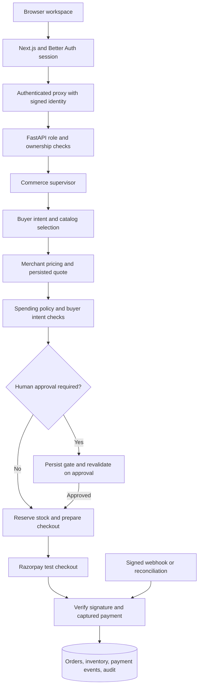

# AgentPay Nexus

**Policy-controlled commerce orchestration with authenticated users, explainable purchase decisions, and verified Razorpay test payments.**

AgentPay Nexus turns a natural-language purchase request into catalog selection, merchant pricing, spending-policy checks, optional human approval, and checkout. Its engineering focus is making the purchase flow safer to retry, easier to inspect, and consistent when inventory, approvals, or payment events change.

Built with **Next.js, TypeScript, Better Auth, FastAPI, SQLAlchemy, SQLite, and Razorpay**. This is a local, single-merchant portfolio prototype using Razorpay test mode.

## What this project improves

| Engineering problem | Implemented improvement | Evidence or observable outcome |
| --- | --- | --- |
| Requests can select unrelated products or misinterpret a budget. | Catalog-grounded parsing, specification matching, exclusions, strict-item rules, and clarification for unsupported requests. | Regression tests cover selection, budget parsing, quantities, stock, and clarification before payment side effects. |
| Browser-supplied identities can expose another user's records. | Better Auth sessions, a signed backend proxy, server-enforced permissions, and user-owned policies, approvals, and orders. | Tests reject forged and stale identities; browser checks verify account isolation. |
| Retries can create duplicate orders or inventory holds. | Persisted workflow idempotency, server-owned quotes, and transactional stock reservations. | Tests replay requests, reuse checkout orders, and prevent two reservations of the last unit. |
| Checkout callbacks can be mistaken for completed payments. | Server-side signatures and provider capture validation, including order ID, amount, and currency. | A Razorpay sandbox payment was completed in the browser, verified, and retained its paid status after refresh. |
| Duplicate payment events can repeat settlement effects. | Payment-event deduplication and transactional settlement with audit writes. | Tests exercise duplicate and concurrent capture, incorrect payment details, and non-capture events. |
| Approval conditions can change while a decision is pending. | Ownership, quote expiry, current policy, price-change, budget, and stock checks before checkout; authenticator verification for high-value approvals. | Tests cover expired quotes, insufficient adjustments, ownership failures, and high-value gates. |
| Provider failures and expired holds can leave misleading state. | Explicit reconciliation states, periodic capture checks for known provider orders, and expired-reservation release. | Tests check provider failure and late capture after stock release, which requires review. |
| Capped layouts waste desktop space and stack panels on laptops. | Fluid workspace width and container-based buyer layouts, with readable form widths on wide screens. | Browser checks from 375px to 2,560px found no page-level horizontal overflow on buyer, seller, and policy screens. |

These are implementation and correctness improvements. Revenue uplift, conversion gains, latency reductions, and production scale have not been measured.

## Architecture and code flow



The browser calls `/api/backend/*` on Next.js. The proxy verifies the session and signs the request identity before forwarding it to FastAPI. Authentication and commerce use separate local databases.

The supervisor coordinates sequential Python components. The active purchase path uses deterministic catalog-grounded parsing; optional AI helpers are separate from the core runtime. LangGraph, a worker queue, and a protocol-conformant MCP server are future work.

## Features

- **Buyer workspace:** purchase requests, quotes, policy decisions, workflow traces, order history, and checkout recovery.
- **Merchant operations:** inventory controls, margin constraints, four pricing strategies, and recorded commerce metrics.
- **Policies and approvals:** per-user purchase limits, rolling daily limits, permitted categories, value-add preferences, and an approval inbox.
- **Account security:** email/password authentication, database-backed auth rate limits, TOTP enrollment, recovery codes, and short-lived high-value authorization.
- **Admin tools:** hash-linked audit inspection and verification, plus scripted failure scenarios.
- **Payment reliability:** integer-paise calculations in the core commerce flow, persisted quotes and reservations, idempotent retries, signed webhooks, and capture validation.

New accounts are buyers. Seller and admin access is assigned using immutable Better Auth user IDs in server-side configuration. Sellers currently retain buyer features, and merchant operations share one merchant catalog.

## Edge cases handled

- Ambiguous requests, unsupported quantities, excluded products, incompatible specifications, and unavailable stock.
- Invalid budgets, malformed payloads, invalid pricing strategies, and unsupported scenario IDs.
- Replayed workflows and conflicting reuse of an idempotency key.
- Last-unit reservation contention and expiry of inventory holds.
- Expired quotes, changed policies, insufficient approval adjustments, and cross-user access attempts.
- Missing, forged, or stale identities and browser mutations with an invalid origin.
- Unsigned or malformed webhooks, duplicate captures, and payment amount, currency, or order mismatches.
- Checkout cancellation, refresh during an unpaid order, provider errors, and late capture after reservation expiry.

Approval prepares checkout. Only a verified captured payment marks an order paid. Late capture without an intact reservation is recorded as `PAID_REQUIRES_REVIEW`.

## Local setup

Use **Node.js 24** for the TypeScript-importing demo seed script and **Python 3.11+**. Commands below use PowerShell. Preserve existing environment files rather than overwriting them.

### Backend

```powershell
cd server
python -m venv venv
.\venv\Scripts\Activate.ps1
pip install -r requirements.lock
Copy-Item .env.example .env
```

Edit `server/.env`: set a random `BACKEND_AUTH_SECRET` of at least 32 characters and your own Razorpay **test** key ID, key secret, and webhook secret. Both database URLs must point to the same commerce database.

Generate each secret independently:

```powershell
python -c "import secrets; print(secrets.token_urlsafe(48))"
```

Start from `server/` so relative database paths remain consistent:

```powershell
uvicorn app.main:app --host 127.0.0.1 --port 8000
```

Startup initializes the local catalog and order-maintenance task. `requirements.lock` records validated Windows dependency versions; `requirements-ai.txt` contains optional AI dependencies.

### Frontend

In a second terminal, from the repository root:

```powershell
cd client
npm ci
Copy-Item .env.example .env.local
```

Configure `client/.env.local`:

| Variable | Purpose |
| --- | --- |
| `BETTER_AUTH_URL` | `http://localhost:3000` |
| `BETTER_AUTH_SECRET` | Separately generated secret of at least 32 characters |
| `BACKEND_AUTH_SECRET` | Exactly the same shared secret as the backend |
| `BACKEND_URL` | `http://127.0.0.1:8000` |
| `BETTER_AUTH_DATABASE` | Local auth database, default `auth.db` |
| `SELLER_USER_IDS`, `ADMIN_USER_IDS` | Comma-separated Better Auth user IDs for privileged roles |
| `NEXT_PUBLIC_DEMO_ACCOUNTS` | `true` only for the local example-account UI and seed script |

```powershell
npm run auth:migrate
# Optional: requires the demo flag and a localhost auth URL.
npm run auth:seed-demo
npm run dev
```

The seed script creates example accounts and adds the seller's user ID to `.env.local`. Run it before starting Next.js, or restart Next.js afterward.

Open **http://localhost:3000**. Backend docs: **http://127.0.0.1:8000/docs**. Public health endpoint: **http://127.0.0.1:8000/api/health**. Protected commerce requests go through the Next.js proxy.

### Local example accounts

| Role | Email | Password |
| --- | --- | --- |
| Buyer | `buyer@example.test` | `BuyerDemo!2026` |
| Seller | `seller@example.test` | `SellerDemo!2026` |

These are intentionally public local demo credentials. Account-security enrollment uses the login password; subsequent authenticator verification uses the enrolled app's code. Environment files, provider secrets, and runtime databases remain local.

## Verification

Latest local verification: **October 10, 2026**.

| Check | Result |
| --- | --- |
| Isolated backend suite | 37 tests passed across intent, approval, authorization, inventory, idempotency, settlement, and route integration |
| Backend route integration | Exercises all 20 backend routes; provider interactions use mocks in the isolated suite |
| Better Auth integration test | Passed registration, session revocation, ownership, and TOTP checks in an ephemeral database |
| Frontend lint and production build | Passed |
| Browser permissions | Buyer/seller sign-in, restricted-route rejection, and user-owned record isolation checked |
| Razorpay sandbox checkout | Captured payment verified and paid status preserved after refresh; cancellation left checkout unpaid and resumable |
| Responsive browser checks | Buyer, seller, and policy screens checked from 375px to 2,560px; mobile navigation checked |

```powershell
# From server/
.\venv\Scripts\python.exe -m unittest discover -s tests -p 'test_*.py' -v

# From client/
npm test
npm run lint
npm run build
```

Sandbox checkout was a manual browser check, separate from the mocked regression suite. Public provider-to-localhost webhook delivery has not been verified. These checks establish local correctness for exercised cases, not production load capacity or exhaustive coverage.

## Resume-ready project highlights

Adapt these bullets to describe your own contribution:

- Built a full-stack commerce orchestration prototype with Next.js, FastAPI, and SQLAlchemy, connecting natural-language purchase requests to catalog-grounded selection, merchant pricing, policy approval, and Razorpay test checkout.
- Integrated Better Auth with TOTP, session-based access, signed backend requests, and role-based permissions to protect user-owned policies, approvals, and orders.
- Implemented idempotent purchase workflows, transactional stock reservations, and deduplicated payment settlement; added regression coverage for concurrent captures, last-unit contention, quote expiry, and payment mismatches.
- Developed a 37-test backend suite with integration coverage across 20 API routes, alongside authentication tests and browser validation of sandbox payments, checkout recovery, and responsive layouts.

Test and route counts are verified scope metrics. Add performance or business-impact percentages only after collecting reproducible benchmarks or real usage data.

## Current boundaries and next steps

- **Scale:** single-merchant SQLite deployment. Move to PostgreSQL and test multi-process contention before scaling workloads.
- **Recovery:** workflow records, quotes, approvals, and orders persist, but there is no general durable workflow engine. Provider failures without a known provider order ID can require manual reconciliation.
- **Roles:** sellers also see personal purchasing and policy screens. Separate buyer and seller experiences further if the product requires exclusive roles.
- **Audit:** hash-linked records provide local tamper evidence; external anchoring remains future work.
- **AI:** the active parser is deterministic. Evaluate an LLM-assisted parser against existing regression cases before introducing model-based decisions.
- **Commerce:** recurring-payment mandates, fulfillment, refunds, production payment operations, and multi-merchant tenancy are not implemented.

## Repository guide

| Path | Responsibility |
| --- | --- |
| `client/src/app/` | Workspace shell, auth handlers, backend proxy, and step-up route |
| `client/src/components/` | Buyer, merchant, policy, security, audit, and checkout UI |
| `client/src/lib/` | Authentication, browser API client, and helpers |
| `server/app/agents/` | Selection, pricing, policy, and orchestration |
| `server/app/api/` | Validated commerce API routes |
| `server/app/commerce.py` | Transaction and reservation helpers |
| `server/app/razorpay/` | Provider order creation and verified settlement |
| `server/app/maintenance.py` | Known-order reconciliation and reservation expiry |
| `server/app/audit/` | Hash-linked audit ledger |
| `server/tests/`, `client/tests/` | Regression and authentication tests |

Earlier documents in `docs/`, `PRD.md`, and `PROJECT_BLUEPRINT.md` describe past snapshots or planned work and can contain gaps since addressed. This README summarizes the current implementation.
