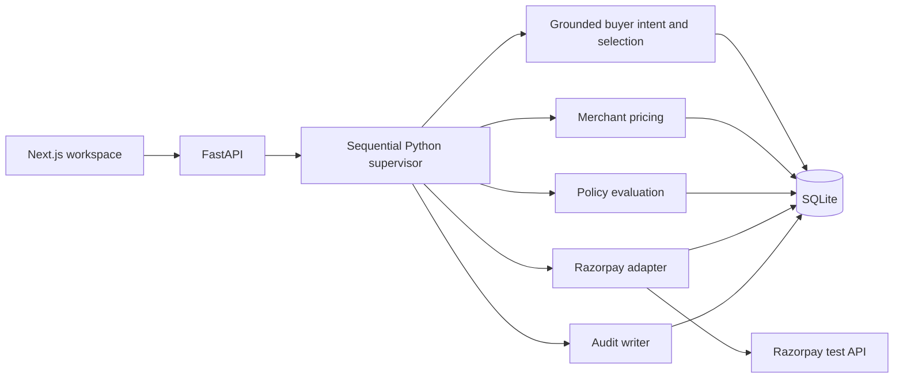
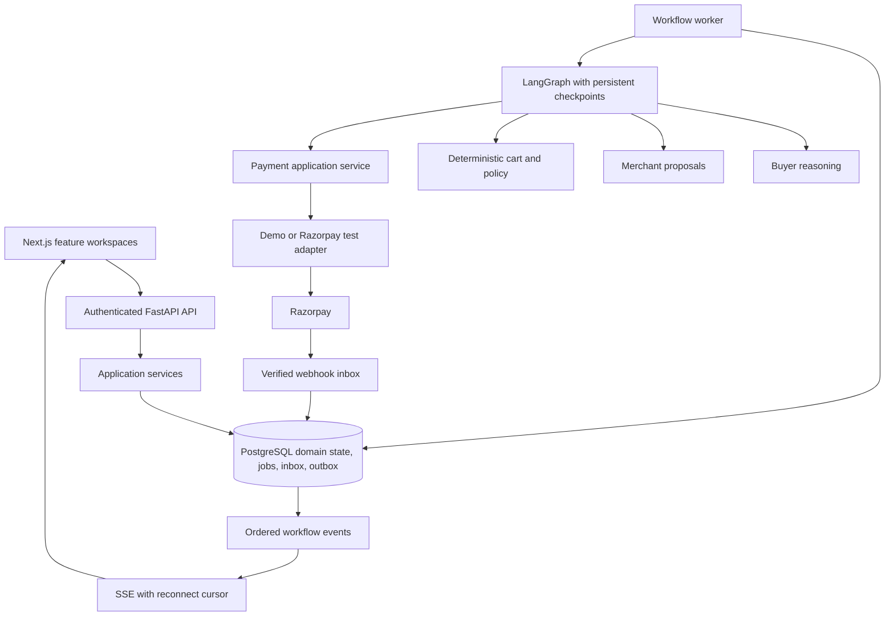

# AgentPay Nexus architecture

Updated 2026-10-09. [The implementation specification](docs/PROJECT_SPECIFICATION.md) describes the actual APIs, data model, and orchestration branches. [The current audit](docs/ARCHITECTURE_AUDIT.md) records architecture coverage and verified checks; [the roadmap](PROJECT_BLUEPRINT.md) defines implementation order. The target system below remains planned.

## Current system

The workflow runs inside its HTTP request. Approvals and orders persist, but complete workflow state and checkpoints do not. Services commit independently, so there is no single transaction boundary for related business writes.

Custom-query browser testing exposed unsafe classification/category fallback and candidate-to-cart expansion. The current request path now uses `agents/purchase_intent.py` as a deterministic authorization boundary: explicit catalog families/SKUs, one unit per family, constraints/exclusions, and the minimum INR budget from text and request. Unsupported clauses, alternatives, conflicting exclusions, foreign currencies, and multi-unit requests return NEEDS_CLARIFICATION before quote/payment side effects. Discovery never silently fulfills only part of a multi-item request. Policy evaluation also takes the minimum of that budget and the stored transaction cap. This is a bounded English/INR parser, not general language understanding; future model suggestions must be validated against this boundary rather than granting purchase authority. See [custom-query evidence and limits](docs/QUERY_TEST_REVIEW.md).
The supplied relational graph has 321 nodes and 699 edges. Its report dates to 2026-09-03 and contains inferred relationships; use current source as authority. The supervisor, catalog, settlement, and audit nodes connect multiple communities. Source inspection confirms mixed orchestration/persistence/provider responsibilities. No import cycles were detected; a wholesale folder rename is not justified.

## Target system

Use a modular monolith running API and worker processes. PostgreSQL owns business state and the initial durable queue. Redis, Kafka, Kubernetes, and microservices are unnecessary for the first portfolio workload.

| Boundary | Responsibility |
| --- | --- |
| API | Identity, ownership, validation, typed contracts |
| Application | Use cases, transaction ownership, idempotency, commands |
| Domain | Money, quote validity, policy, inventory/payment transitions |
| Orchestration | Typed graph, bounded routing, checkpoints, human interrupts |
| Infrastructure | SQL repositories, model/payment adapters, telemetry |
| UI | Drafts, state rendering, readable evidence; no secret keys |

Buyer/merchant models produce structured proposals. Reviewer nodes validate them. Policies, reservations, payment verification, and writes remain deterministic. Allow at most one quote revision after buyer review, then ask for human clarification.

## Persistence and state

Use PostgreSQL and Alembic. Persist workflows, intent/quote revisions, approvals, orders, payment attempts, stock/spend reservations, workflow events, webhook inbox, and job/outbox records. Replace fixed buyer IDs with explicit identity and foreign keys.

Money is integer paise plus currency. Version quotes and policies. Quote digests cover lines, quantities, prices, currency, expiry, and merchant identity.

Workflow states: RECEIVED, INTERPRETING, QUOTING, POLICY_CHECK, AWAITING_APPROVAL, RESERVING, AWAITING_PAYMENT, COMPLETED; alternative outcomes are NEEDS_CLARIFICATION, REJECTED, FAILED, EXPIRED, RECOVERY_REQUIRED. Payment attempts independently track CREATING, CREATED, AUTHORIZED, CAPTURED, FAILED, UNKNOWN.

Approval resumes the same workflow/thread. Reevaluate quote expiry, inventory, policy, and authorized budget revision. Checkpointing is not payment idempotency; every side effect also needs database-level business keys and guarded transitions.

## Payment and concurrency

- Derive order amount/items from the persisted server quote; never trust a client amount.
- Reserve every line and spend capacity in one transaction with conditional updates and checked row counts. Fail the whole reservation if one line fails.
- Commit a payment attempt/job before provider submission; do not hold DB transactions across network calls.
- Enforce one active attempt per order and one application per provider payment ID. Lock/check state before transitions.
- Require raw-body webhook signatures; deduplicate event IDs; check known order, amount, currency, and captured status.
- Checkout and webhooks use the same idempotent settlement service. Commit business effects and audit events together.
- Provider timeout after submission enters UNKNOWN for reconciliation. Never silently fabricate success or blindly resubmit.
- Ten-minute reservation expiry first reconciles pending provider state. Late capture or ambiguity goes to RECOVERY_REQUIRED rather than silently releasing paid inventory.

Serialize audit append with a locked per-stream head and unique sequence. Verify genesis and subsequent links. Hash chaining is tamper evidence; external signed anchoring is deferred, so immutability and non-repudiation claims are excluded.

## Planned interfaces

Introduce POST `/api/v1/workflows` with idempotency key returning 202/workflow ID; GET `/workflows/{id}`; SSE `/workflows/{id}/events` with ordered IDs and reconnect cursor; and `/approvals/{id}/decision` with typed action and expected version.

Checkout verification accepts an owned order reference and provider IDs/signature, never a client-authoritative amount. Generate frontend types from versioned OpenAPI. Keep existing `/api` compatible until UI migration. The current UI repair adds optional `razorpay_order` to approval responses.

## Folder strategy

Retain `client/` and `server/` in the same repository. As behavior is extracted, organize backend ownership into api, application, domain, orchestration, infrastructure. Domain code has no framework imports. Keep configuration small.

Group frontend work into buyer, merchant, approvals, audit, and scenarios features with shared UI/API utilities. Move files alongside tests and behavior changes, updating imports/docs/start commands together. Do not perform a cosmetic mass move.

## References

[LangGraph persistence](https://docs.langchain.com/oss/python/langgraph/persistence) supports durable thread checkpoints. [Razorpay webhook guidance](https://github.com/razorpay/markdown-docs/blob/master/webhooks/best-practices.md) addresses duplicate delivery. [Razorpay test integration](https://razorpay.com/docs/server-integration/python/test-app/) documents server verification of checkout signatures.
