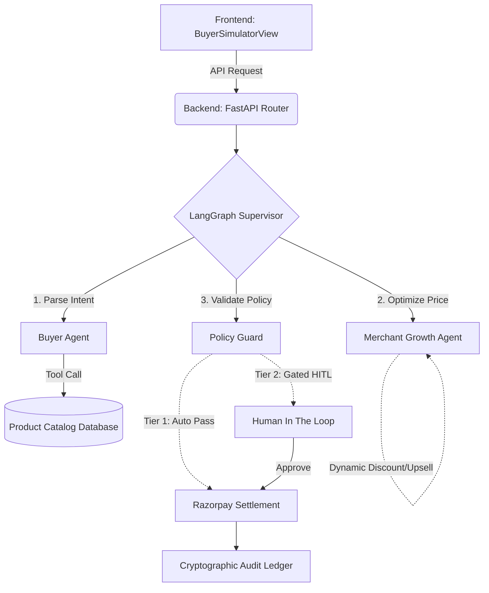

# AgentPay Nexus Architecture Overview

Welcome to the codebase! AgentPay Nexus is a multi-agent autonomous commerce engine. The system is split into a **Python FastAPI backend** (which handles the heavy lifting of AI orchestration via LangGraph) and a **Next.js frontend** (which provides a beautiful, real-time dashboard for visibility and control).

Here is a guide on how the system works and the best files to read to understand the architecture.

## 1. High-Level System Flow

The core of the project is a multi-agent workflow orchestrated by LangGraph. When a user (buyer) submits an intent (e.g., "Buy me a 4k monitor under ₹25,000"):

## 2. Where to start reading? (Backend)

The backend (`d:\Razor_Pay_Track\server`) is built with **FastAPI** and **LangGraph**. Start here to understand the AI logic:

### The Brain: LangGraph Supervisor
- **[supervisor.py](file:///d:/Razor_Pay_Track/server/app/agents/supervisor.py)**: This is the most important file in the backend. It defines the state machine (`StateGraph`). It coordinates the hand-offs between the Buyer, Merchant, and Policy agents. 

### The Agents
Read these to see how each specialized AI thinks and acts:
- **[buyer_agent.py](file:///d:/Razor_Pay_Track/server/app/agents/buyer_agent.py)**: Interprets natural language intent, searches the catalog, and builds a cart.
- **[merchant_agent.py](file:///d:/Razor_Pay_Track/server/app/agents/merchant_agent.py)**: Applies dynamic revenue algorithms (like Conversion Closer or Vertical Upsell) while strictly protecting the merchant's margin floor.
- **[policy_guard.py](file:///d:/Razor_Pay_Track/server/app/agents/policy_guard.py)**: Acts as the safety sentinel. It enforces budget caps and whitelists, triggering Human-in-the-Loop (HITL) gates if boundaries are crossed.

### APIs & Data
- **[agent_router.py](file:///d:/Razor_Pay_Track/server/app/api/agent_router.py)**: The FastAPI endpoints that the frontend calls to start a workflow or resolve a HITL gate.
- **[crud.py](file:///d:/Razor_Pay_Track/server/app/db/crud.py)**: Database operations for products, the policy configuration, and the cryptographic ledger.

## 3. Where to start reading? (Frontend)

The frontend (`d:\Razor_Pay_Track\client`) is a **Next.js** application. Start here to understand the UI architecture:

### The Entry Point
- **[page.tsx](file:///d:/Razor_Pay_Track/client/src/app/page.tsx)**: The main layout container. It manages the state for the active tab (Buyer, Merchant, Policy, etc.) and houses the Navigation bar.

### The Core Views
- **[BuyerSimulatorView.tsx](file:///d:/Razor_Pay_Track/client/src/components/BuyerSimulatorView.tsx)**: Where the user types their intent. Look here to see how we render the dynamic quote, handle the HITL Explainability Card, and trigger Razorpay.
- **[StateGraphVisualizer.tsx](file:///d:/Razor_Pay_Track/client/src/components/StateGraphVisualizer.tsx)**: The visual pipeline component that dynamically highlights which LangGraph node (Agent) is currently executing in real-time.
- **[MerchantGrowthView.tsx](file:///d:/Razor_Pay_Track/client/src/components/MerchantGrowthView.tsx)**: The dashboard where the merchant configures their protected margin floor and active AI algorithms.
- **[PolicyGuardView.tsx](file:///d:/Razor_Pay_Track/client/src/components/PolicyGuardView.tsx)**: Where users manage safety boundaries (like max limits) and manually approve/reject gated transactions.

### The API Layer
- **[api.ts](file:///d:/Razor_Pay_Track/client/src/lib/api.ts)**: A clean wrapper around the standard `fetch` API. It defines all the TypeScript interfaces for the backend responses (Quotes, Audit Trails, Workflows). 

## 4. Key Design Patterns to Notice

1. **Deterministic Bounding**: Notice how the `MerchantGrowthAgent` can generate creative discounts, but before returning, it strictly checks `if new_margin < margin_floor`. AI proposes, code disposes.
2. **Explainability**: The system never just rejects or pauses a transaction. It always returns an `ExplainabilityCard` object containing the exact policy rule that was violated, making AI behavior transparent.
3. **Cryptographic Auditing**: Every agent action is appended to a ledger. Notice how each block includes an `entry_hash` created using the `prev_hash` (just like a Blockchain), guaranteeing that autonomous actions cannot be secretly altered after the fact.
