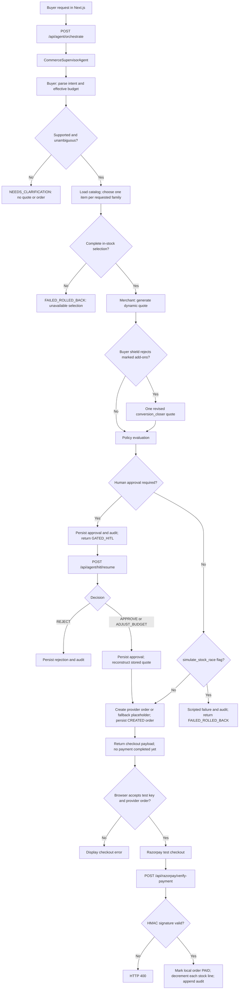

# AgentPay Nexus — implementation specification

Reviewed against local source on **2026-10-09**. This document describes the implemented prototype. [PRD](../PRD.md) and [blueprint](../PROJECT_BLUEPRINT.md) describe the future target. See [the architecture audit](ARCHITECTURE_AUDIT.md) for gaps and verification limits.

## Purpose and portfolio scope

AgentPay Nexus models controlled purchasing from one merchant: translate a buyer request into catalog items, apply merchant pricing, evaluate spending policy, request human approval when needed, and prepare Razorpay checkout. It demonstrates backend coordination, business rules, typed APIs, operator UI, and decision auditing.

It is a local portfolio prototype. Pricing savings are calculations on seeded inventory; merchant dashboard totals are local records. They are not evidence of real revenue, customers, conversion uplift, or production reliability.

## Technology and deployment shape

| Layer | Implementation | Source |
| --- | --- | --- |
| Browser workspace | Next.js 16.3.3, React 19.2.8, TypeScript, Tailwind CSS 4, Lucide icons | `client/package.json`, `client/src/app/` |
| API | FastAPI, Pydantic request/response models, Uvicorn | `server/app/main.py`, `server/app/schemas/agent_schemas.py` |
| Coordination | Sequential Python method calls inside an HTTP request | `server/app/agents/supervisor.py` |
| Buyer selection | Deterministic catalog-grounded English/INR parser and selector | `server/app/agents/purchase_intent.py` |
| Storage | SQLAlchemy async SQLite routes; synchronous startup schema/seed | `server/app/db/` |
| Payments | Razorpay Python SDK; browser provider checkout script; HMAC verification | `server/app/razorpay/`, `client/src/lib/razorpay-checkout.ts` |
| Audit | SHA-256 links between SQL records | `server/app/audit/ledger.py` |
| Optional model helpers | Lazy SmolLM-135M-Instruct and all-MiniLM-L6-v2 helpers, not invoked by current buyer request path | `server/app/agents/buyer_agent.py` |
| Verification | Python unittest suites; ESLint; TypeScript; Next.js build | `server/tests/`, `client/package.json` |

There are two local application processes: frontend and API. No implemented LangGraph, separate workflow worker, durable queue, PostgreSQL migration system, SSE endpoint, or network MCP server was found. Installed LangChain-related dependencies do not make the coordinator a LangGraph graph.

## Roles and screens

| View | What a reviewer can inspect |
| --- | --- |
| Buyer simulator | Purchase goal, budget, intent constraints, quote, policy outcome, returned step trace, test checkout |
| Merchant workspace | Catalog inventory/prices, pricing configuration, local paid-order metrics |
| Policy guard | Spending caps, category settings, unsolicited-upsell setting, pending approval decisions |
| Audit ledger | Stored decisions, payloads, hashes, chain verification result |
| Scenario lab | Preconfigured budget, stock-failure, and strict-purchase requests |

These are UI roles, not enforced access-control roles. Backend identity is largely fixed to one seeded buyer and merchant. Mutation endpoints do not authenticate or enforce ownership.

## Current orchestration



The diagram shows actual calls and branches, including the unsafe backend fallback. It does not imply atomicity. Webhooks currently take a separate audit-only path and do not settle an order.

### Request, budget, and selection

`AgentWorkflowRequest` accepts `user_goal` (trimmed, 1–2000 characters), finite positive `budget_cap_inr` (default ₹25,000), `strict_items_only`, `allow_autonomous_upsell`, optional `force_growth_model`, and `simulate_stock_race`.

The effective budget is the lower of the request budget and an explicit recognized INR budget in the goal. The buyer parses known product families/SKUs, exclusions, and supported constraints. It selects one grounded product per requested family and requires a complete selection. Unsupported quantities, unresolved clauses, and conflicting exclusions lead to clarification before quote or payment creation. This is a bounded parser, not general natural-language understanding.

The normal buyer path calls `parse_purchase_intent` and `select_products`; it does not invoke the optional chat or embedding helpers. Catalog discovery is an in-process SQL read. JSON-LD product metadata and names containing “MCP” are not an MCP protocol implementation.

### Pricing

`MerchantGrowthAgent` calculates a quote from server catalog prices and costs. Strategies are `quality_upgrade`, `conversion_closer`, `bulk_subscription`, and `value_services`. They respectively attempt a higher-tier SKU, apply a discount, illustrate subscription pricing, or add warranty services. Subscription pricing does not create recurring mandates. A merchant HMAC signature and expiry are included in the quote, but downstream policy/payment code does not validate them.

The buyer shield rejects items marked `is_unrequested_upsell` when strict mode is active. It does not comprehensively revalidate every final quote line against requested SKUs/specifications. Quality upgrades can still occur in strict mode; an exact initial selection therefore does not guarantee the final SKU remains unchanged.

### Policy and approval

Policy compares the quote with the lower of stored transaction cap and effective request budget, rolling 24-hour local `PAID` spending, a category list, and the unsolicited-upsell setting. Values above ₹25,000 enter `TIER_3_HARD_GATE`; other violations enter `TIER_2_GATED_HITL`; otherwise the result is `TIER_1_AUTONOMOUS`.

Both gated tiers persist an approval record containing a serialized quote and return `GATED_HITL`. Tier 3 does not implement OTP or biometric verification. Approval decisions are `APPROVE`, `REJECT`, or `ADJUST_BUDGET`. Resume loads the stored approval, rejects already-resolved records, and creates checkout from its stored quote after approval. It does not resume a persisted graph checkpoint. Adjusted budget is recorded in the audit payload rather than used for a fresh policy/quote evaluation. Quote expiry, signature, current inventory, and immutable policy violations are not rechecked.

### Payment and status semantics

| Current value | Actual meaning |
| --- | --- |
| `NEEDS_CLARIFICATION` | Input cannot safely produce a purchase plan |
| `GATED_HITL` | Approval persisted; no provider order created by that initial path |
| `FAILED_ROLLED_BACK` | Unavailable selection or scripted stock failure; name does not prove transactional rollback |
| `COMPLETED_AUTONOMOUS` | Coordinator prepared an order and audit entry; payment still pending |
| Order `CREATED` | Local order persisted; provider ID may be a fallback placeholder |
| Order `PAID` | Local settlement accepted a valid checkout HMAC; provider capture/amount/currency are not fetched and verified |

`total_spent` on a workflow response can be the quoted total before payment. Treat it as a quote amount. An event named `AUTONOMOUS_CHECKOUT_CONFIRMED` similarly records order preparation.

Provider order creation converts float INR into integer paise, calls the synchronous SDK from async code, and persists a local order. SDK errors can silently produce `order_rzp_*` placeholders. The browser rejects placeholders and keys outside test mode. These client checks do not secure direct API calls.

Checkout verification uses HMAC-SHA256 over provider order/payment IDs. Local settlement currently lacks duplicate protection, ignores failed stock decrements, and commits lines separately. Unknown orders can still receive a successful verification response. The webhook endpoint validates a signature only when supplied, appends the event to audit, and returns success without applying capture to the order.

## Storage model

| Table | Stored information | Current limitations |
| --- | --- | --- |
| `products` | SKU, category, specs/JSON-LD, costs/prices, stock, upgrades, warranty, subscription flag | Float money; stock updated by read/modify/write |
| `merchants` | Margin floor, enabled-model list, signing key | Fixed demo merchant; strategy execution does not enforce enabled-model list |
| `policies` | User caps, category list, upsell setting, drift tolerance | Fixed demo identity; drift tolerance not enforced by policy evaluation |
| `orders` | Quote ID, provider IDs, status, amounts, item JSON, pricing strategy | Provider IDs not unique; no durable payment attempts/reservations |
| `hitl_approval_queue` | Serialized quote, reasons, explanation, status, resolution time | No full workflow checkpoint or decision version |
| `audit_ledger` | Unique sequence, timestamp, actor/action, payload JSON, previous/current hashes | Concurrent append race; no external trusted anchor |

Tables use string references and JSON snapshots rather than enforced business foreign-key relationships. Complete workflow state and the returned step list are not stored. Approval/order/audit services commit independently. SQLite schema is created with `Base.metadata.create_all`, not versioned migrations. Startup seeds local demo data.

Hash chaining detects changed stored content when compared with existing links. It does not prevent a database writer from rewriting the whole chain. The verifier also omits the genesis-parent check and does not enforce contiguous sequences.

## API inventory

Default prefix is `/api`; request and response schemas are exposed at `/docs`, `/redoc`, and `/openapi.json` on the backend.

| Method | Path | Function |
| --- | --- | --- |
| GET | `/api/health` | Static service metadata; not a dependency readiness check |
| GET | `/api/catalog/products` | Catalog listing |
| POST | `/api/catalog/agent-query` | Catalog filtering |
| PATCH | `/api/catalog/products/{sku}` | Inventory/price mutation |
| POST | `/api/agent/quote` | Direct merchant quote |
| POST | `/api/agent/orchestrate` | Synchronous coordinated purchase request |
| GET | `/api/agent/hitl/pending` | Pending approval list |
| POST | `/api/agent/hitl/resume` | Approval/rejection/budget-adjust decision |
| GET, PUT | `/api/policy/config` | Read/update buyer policy |
| GET | `/api/merchant/dashboard` | Configuration and local paid-order metrics |
| POST | `/api/merchant/config` | Merchant configuration mutation |
| POST | `/api/razorpay/create-order` | Direct order creation; currently accepts client amount |
| POST | `/api/razorpay/verify-payment` | Checkout signature verification and local settlement |
| POST | `/api/razorpay/webhook` | Event audit receipt |
| GET | `/api/audit/trail` | Recent ledger records |
| GET | `/api/audit/verify` | Chain recomputation |
| POST | `/api/chaos/trigger` | Run predefined scenario request |

Example request:

```json
{
  "user_goal": "Buy a 4K monitor and ergonomic keyboard under ₹25,000",
  "budget_cap_inr": 25000,
  "strict_items_only": true,
  "allow_autonomous_upsell": false,
  "force_growth_model": "conversion_closer"
}
```

The response contains a generated workflow ID, status, ordered actor/action traces, and optional quote, policy, approval gate, checkout payload, and audit hash. The pending-gate endpoint currently exposes the quote ID as `workflow_id`, which does not match the initial `wf_*` trace identity.

## Frontend integration and failures

`client/src/lib/api.ts` centralizes typed fetch helpers. `NEXT_PUBLIC_API_URL` defaults to `http://127.0.0.1:8000/api`. Orchestration/scenario requests time out after 120 seconds; other requests after 15 seconds. A browser timeout does not cancel or reverse server business effects. Traces are returned at request completion rather than streamed. Frontend types are handwritten rather than generated from OpenAPI.

The provider script loads from `https://checkout.razorpay.com/v1/checkout.js`. Checkout returns IDs and a signature for server verification; the frontend does not generate a substitute payment signature. There is no need for a browser secret environment variable.

## Repository guide

```text
client/src/app/          Next.js shell and styles
client/src/components/  Buyer, merchant, policy, audit, scenario and shared views
client/src/lib/         API contracts and provider script loading
server/app/api/         HTTP routing
server/app/agents/      Buyer parser, merchant pricing, policy, coordinator
server/app/catalog/    SQL catalog and inventory operations
server/app/razorpay/    Provider adapter and local settlement
server/app/audit/       Hash-chain append and verification
server/app/db/          ORM models, sessions and seeds
server/app/schemas/     Pydantic contracts
server/tests/           Isolated intent and approval tests; browser fixtures
docs/                   Specifications, reviews and captured UI evidence
```

## Verification and next implementation steps

See [the dated audit](ARCHITECTURE_AUDIT.md) for checks executed in this review. The existing automated suite covers a narrow subset of behavior. Scenario requests are demonstrations, not proofs of concurrency, rollback, or provider recovery.

The implementation order remains [the six-phase blueprint](../PROJECT_BLUEPRINT.md): payment/domain correctness and access control; durable orchestration; AI evaluations; operator acceptance; reliability evidence; reproducible packaging. No latency, throughput, availability, or business uplift target has been established by the current test suite.
