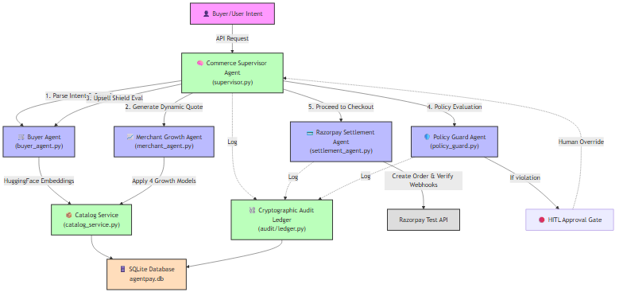

# Razorpay Track Agent - 5-Minute Pitch Script & Architecture Breakdown

> [!TIP]
> **Video Strategy**
> Since you have only 5 minutes, keep a brisk pace. Focus heavily on the **Multi-Agent Orchestration**, **Dynamic Growth Models**, and the **Cryptographic Audit Ledger**. These are the key differentiator features that a Razorpay recruiter will love.

---

## 📸 Visual 1: The Architecture Diagram (Display while talking)

Here is a comprehensive backend architecture diagram.

---

## ⏱️ The 5-Minute Script

### [0:00 - 0:45] Introduction & The Problem
**Visual:** Have the architecture diagram on screen, or your code editor open to `app/main.py` and the `app/agents/` folder.

**You:**
"Hi, I'm [Your Name]. Today I'm presenting the **Razorpay Track Agent**. 
The core problem we are solving is the friction and missed revenue in traditional e-commerce checkouts. Buyers want strict adherence to their budget and intent, while merchants want to maximize Lifetime Value (LTV) and margin. Traditionally, this is a zero-sum game.

My solution is a **Multi-Agent Autonomous Commerce Engine** that negotiates the cart in real-time, enforcing user constraints while programmatically optimizing merchant revenue, all settled securely over Razorpay rails."

### [0:45 - 2:00] Backend Architecture & The Supervisor
**Visual:** Point to the `CommerceSupervisorAgent` in `supervisor.py`.

**You:**
"Let's dive straight into the backend architecture. The system is built on FastAPI with asynchronous SQLAlchemy.

The heart of the engine is the `CommerceSupervisorAgent` in `supervisor.py`. It acts as the central state machine. When a buyer submits a natural language request, the Supervisor orchestrates a workflow between four specialized agents.

First, it calls the `BuyerAgent` (`buyer_agent.py`). This agent uses local Hugging Face models—specifically `SmolLM-135M-Instruct` for intent parsing and `all-MiniLM-L6-v2` for semantic product search. It queries our `CatalogService` via an MCP (Model Context Protocol) to find exactly what the user wants based on semantic similarity, not just keyword matching."

### [2:00 - 3:00] Merchant Growth Models & The Buyer Shield
**Visual:** Show `merchant_agent.py` and point out the 4 models.

**You:**
"Once the items are found, the Supervisor hands off to the `MerchantGrowthAgent` (`merchant_agent.py`). This is where the magic happens. Based on the merchant's margin floor and the buyer's budget headroom, this agent dynamically deploys one of 4 Revenue Growth Models:
1. **Quality Upgrade:** Upselling to a premium SKU if budget allows.
2. **Conversion Closer:** Applying dynamic anti-abandonment discounts.
3. **Bulk/Subscription:** Locking in LTV with a recurring mandate discount.
4. **Value-Add Services:** Attaching high-margin digital warranties.

But we protect the buyer! The quote goes back to the `BuyerAgent` which acts as an 'Upsell Shield'. If the merchant attached unrequested physical accessories and the user requested strict adherence, the Buyer Agent automatically rejects them and forces the Merchant Agent to renegotiate the quote gracefully."

### [3:00 - 4:00] Policy Guard & Human-in-the-Loop (HITL)
**Visual:** Show `agent_router.py` highlighting the `/hitl/pending` and `/hitl/resume` endpoints.

**You:**
"Next, the `PolicyGuardAgent` reviews the final quote. If the transaction breaches a hard budget cap or violates strict category rules, the agent triggers a **Human-In-The-Loop (HITL) Interrupt**. 

The autonomous execution halts completely. The state is saved in the database under the `HITLApprovalQueue`. The frontend is notified, and a human operator or the user must provide a 1-click authorization via the `/agent/hitl/resume` endpoint to proceed. This ensures total safety for high-risk transactions."

### [4:00 - 5:00] Settlement & Cryptographic Audit Ledger
**Visual:** Show `razorpay_router.py` (specifically `verify_payment_signature`) and `audit/ledger.py`.

**You:**
"Finally, the settlement. The `RazorpaySettlementAgent` takes over. It creates a real Razorpay Test Order. Once the checkout modal succeeds, our backend receives the webhook or direct verification payload. We strictly verify the HMAC-SHA256 signature using Razorpay's exact specifications to prevent repudiation and tampering.

Simultaneously, every single action—intent parsing, quote generation, HITL overrides, and final checkout—is appended to our `AuditLedgerEngine`. This isn't just a log; it's a **Cryptographic Hash Chain**, meaning every entry hashes the payload along with the previous entry's hash. It creates an immutable, verifiable trail of exactly how the AI agents arrived at the final transaction.

In summary, this is a secure, autonomous e-commerce nexus that bridges buyer intent with merchant profitability, powered seamlessly by Razorpay. Thank you."

---

## 📂 Key File & Folder Structure Reference
Use this as a reference if they ask where things are located.

*   `app/main.py` - FastAPI entry point, CORS, startup logic.
*   `app/agents/supervisor.py` - Central orchestrator (`CommerceSupervisorAgent`).
*   `app/agents/buyer_agent.py` - Natural language parsing, ML embeddings, and Upsell Shield.
*   `app/agents/merchant_agent.py` - Dynamic quoting & 4 Growth Models.
*   `app/api/razorpay_router.py` - Razorpay Order Creation, HMAC Webhook Verification.
*   `app/api/agent_router.py` - Core endpoints for quoting, orchestration, and HITL (Human-in-the-Loop) resolution.
*   `app/catalog/catalog_service.py` - Inventory queries, atomic stock decrements.
*   `app/db/models.py` - SQLAlchemy Schema definitions (`Product`, `Order`, `AuditEntry`, `HITLApprovalQueue`).
*   `app/audit/ledger.py` - The SHA-256 blockchain-style audit logging.
*   `app/razorpay/settlement_agent.py` - The actual Razorpay API integration logic.
